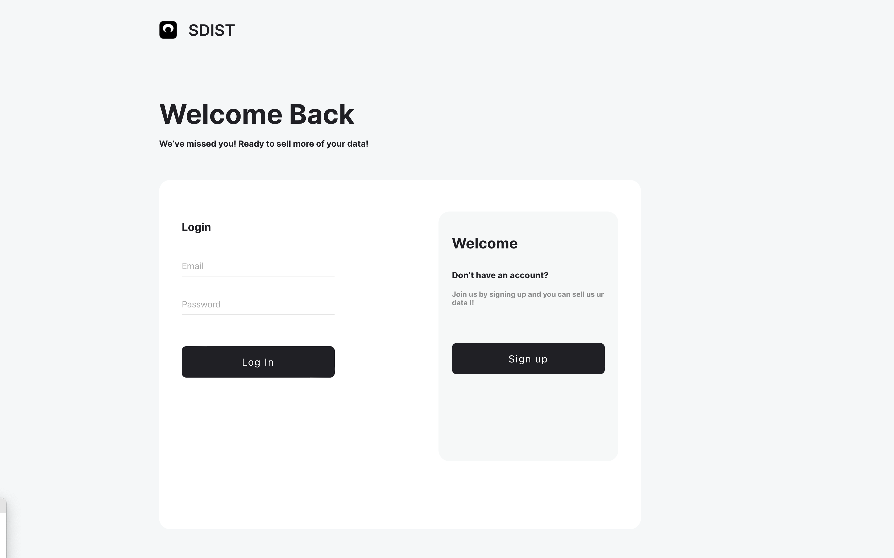

### Information
**Group Name:** `HTTP-Academy`  
**CMPUT 404 Project Name:** `SDIST`  

### Links
[Public URI](https://chimp-chat-1e0cca1cc8ce.herokuapp.com/)  
[API Documentation](https://cmput404-httpacademy15-6f9ce3a9597d.herokuapp.com/swagger)
[Team Wiki](https://github.com/uofa-cmput404/404f23project-http-academy/wiki)
[Video](https://youtu.be/lszR3KuJQAo)
[Project requirements](https://github.com/uofa-cmput404/project-socialdistribution/blob/master/project.org) 

<br>

Demo Video: `link`

https://youtu.be/lszR3KuJQAo




<br>

## Contributors / Licensing

Authors:
    
* Ogooluwa Samuel osamuel@ualberta.ca
* Rahul Korde rkorde@ualberta.ca
* Glory Omosomwan glory@ualberta.ca
* Jefferson Fong 
* Toufic Saadeh toufic@ualberta.ca - **Joined November 3rd, 2023**
* Matheus Duncan 


<br> 

Generally everything is LICENSE'D under the MIT License.

<br></br>

## Public Users
Front-end URL: https://http-academy.netlify.app/

Backend URL: https://cmput404-httpacademy15-6f9ce3a9597d.herokuapp.com/

API Documentation: https://cmput404-httpacademy15-6f9ce3a9597d.herokuapp.com/swagger
```
Username: admin@email.com
Password: admin

```

<br>

## Group Connections

### WhoisWill
Front-End URL: https://whosocialwill.netlify.app/

Backend URL: https://whoiswill-130181bf2e5e.herokuapp.com/

```
username: httpacademy
password: cmput-404
```

Link to API docs: https://whoiswill-130181bf2e5e.herokuapp.com/swagger

Connectivity: Fully connected.

<br>

### Team == good
Backend / Frontend URL:  https://cmput404-social-network-401e4cab2cc0.herokuapp.com/

```
username: admin    
password: admin
```

Link to API docs: https://cmput404-social-network-401e4cab2cc0.herokuapp.com/swagger

Connectivity: Can send authors and posts. Can recieve authors


<br>


## User Stories
   
   - [x] As an author I want to make public posts.
   - [x] As an author I want to edit public posts.
   - [ ] As an author, posts I create can link to images.
   - [x] As an author, posts I create can be images.
   - [x] As a server admin, images can be hosted on my server.
   - [x] As an author, posts I create can be private to another author
   - [x] As an author, posts I create can be private to my friends
   - [x] As an author, I can share other author's public posts
   - [x] As an author, I can re-share other author's friend posts to my friends
   - [x] As an author, posts I make can be in simple plain text
   - [x] As an author, posts I make can be in CommonMark
   - [x] As an author, I want a consistent identity per server
   - [x] As a server admin, I want to host multiple authors on my server
   - [x] As a server admin, I want to share public images with users
     on other servers.
   - [x] As an author, I want to pull in my github activity to my "stream"
   - [x] As an author, I want to post posts to my "stream"
   - [x] As an author, I want to delete my own public posts.
   - [x] As an author, I want to befriend local authors
   - [ ] As an author, I want to befriend remote authors
   - [x] As an author, I want to feel safe about sharing images and posts
     with my friends -- images shared to friends should only be
     visible to friends. [public images are public]
   - [x] As an author, when someone sends me a friends only-post I want to
     see the likes.
   - [x] As an author, comments on friend posts are private only to me the
     original author.
   - [x] As an author, I want un-befriend local and remote authors
   - [x] As an author, I want to be able to use my web-browser to manage
     my profile
   - [x] As an author, I want to be able to use my web-browser to manage/author
     my posts
   - [x] As a server admin, I want to be able add, modify, and remove
     authors.
   - [ ] As a server admin, I want to OPTIONALLY be able allow users to sign up but
     require my OK to finally be on my server
   - [x] As a server admin, I don't want to do heavy setup to get the
     posts of my author's friends.
   - [x] As a server admin, I want a restful interface for most operations
   - [x] As an author, other authors cannot modify my public post
   - [x] As an author, other authors cannot modify my shared to friends post.
   - [x] As an author, I want to comment on posts that I can access
   - [x] As an author, I want to like posts that I can access
   - [x] As an author, my server will know about my friends
   - [x] As an author, When I befriend someone (they accept my friend request) I follow them, only when
     the other author befriends me do I count as a real friend -- a bi-directional follow is a true friend.
   - [x] As an author, I want to know if I have friend requests.
   - [x] As an author I should be able to browse the public posts of everyone
   - [x] As a server admin, I want to be able to add nodes to share with
   - [x] As a server admin, I want to be able to remove nodes and stop
     sharing with them.
   - [ ] As a server admin, I can limit nodes connecting to me via
     authentication.
   - [x] As a server admin, node to node connections can be authenticated
     with HTTP Basic Auth
   - [x] As a server admin, I can disable the node to node interfaces for
     connections that are not authenticated!
   - [x] As an author, I want to be able to make posts that are unlisted,
     that are publicly shareable by URI alone (or for embedding images)


### Running Instructions (on the lab machines):
* Create venv:
    * `virtualenv venv --python=python3`
    * `source venv/bin/activate`
* Install Requirements:
    * `pip install -r requirements.txt`
    * You may see an error for "Building wheel for svglib", that is okay
* Run the project:
    * `python3 manage.py runserver`
    * This will start a webserver on the lab machine's `localhost:8000`
        * If you are SSH-ing into the lab machine, you will need to forward this port in order to see the site on your device. Vscode makes this very easy.
* To deactivate the web server, simply hit `ctrl-c` in the terminal.

### Operating Instructions:
* To log in for the first time, visit `http://127.0.0.1:8000`
* Posts:
    * To see the posts on your feed, visit `http://127.0.0.1:8000/posts/`
* To see a list of the users, visit `http://127.0.0.1:8000/authors/`


